# Mastermind. Versión Ficheros
Universo Santa Tecla  
[uSantaTecla@gmail.com](mailto:uSantaTecla@gmail.com)  
  
**Índice**

1. [Analisis](#analisis)  
   1.1. [Casos de Uso](#casos-de-uso)  
      1.1.1. [Analisis Start](#analisis-start)  
      1.1.2. [Analisis Open](#analisis-open)  
      1.1.3. [Analisis Propose](#analisis-propose)  
      1.1.4. [Analisis Undo](#analisis-undo)  
      1.1.5. [Analisis Redo](#analisis-redo)  
      1.1.6. [Analisis Exit](#analisis-exit)  
      1.1.7. [Analisis Save](#analisis-save)  
      1.1.8. [Analisis Resume](#analisis-resume)  
   1.2. [Paquetes](#paquetes)  
      1.2.1. [Vistas](#vistas)  
      1.2.2. [Controladores](#controladores)  
      1.2.3. [Modelos](#modelos)  
      1.2.4. [Types](#types)  
2. [Diseño](#diseño)  
   2.1. [Vista de Despliegue](#vista-de-despliegue)  
   2.2. [Vista de Participantes](#vista-de-participantes)  
   2.3. [Vista de Interaccion de Participantes](#vista-de-interaccion-de-participantes)  
  

## Analisis
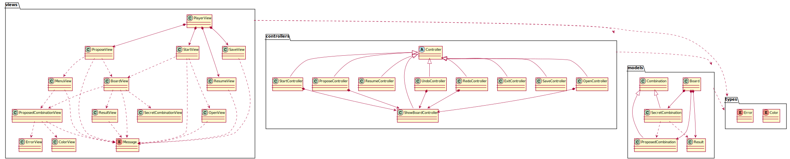

## Casos de Uso

### Analisis Start
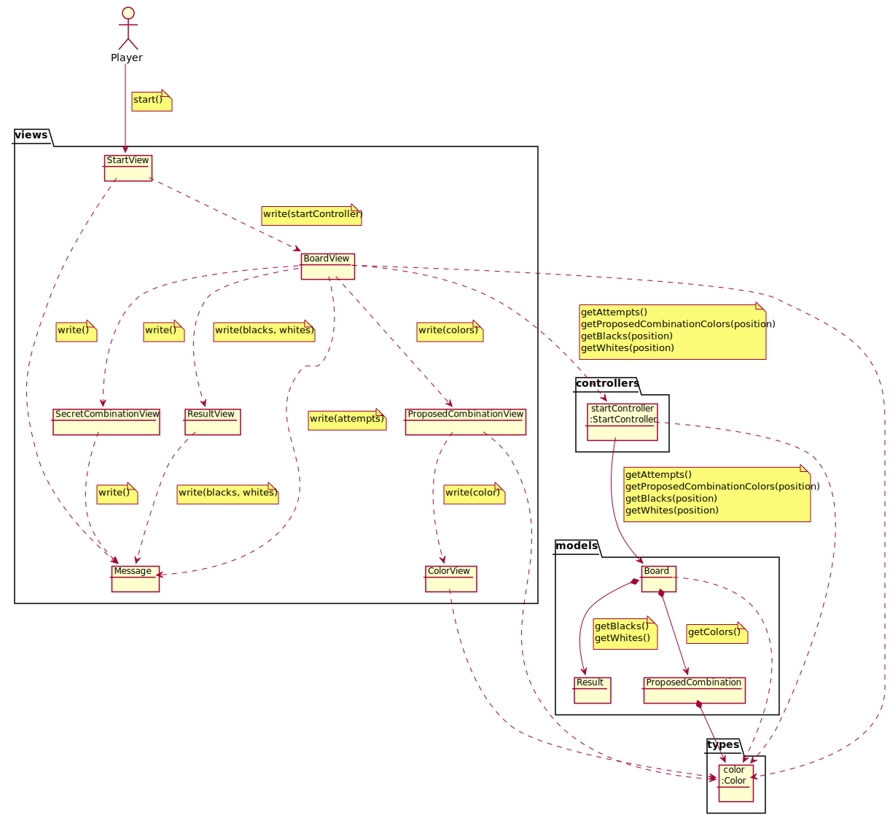

### Analisis Open
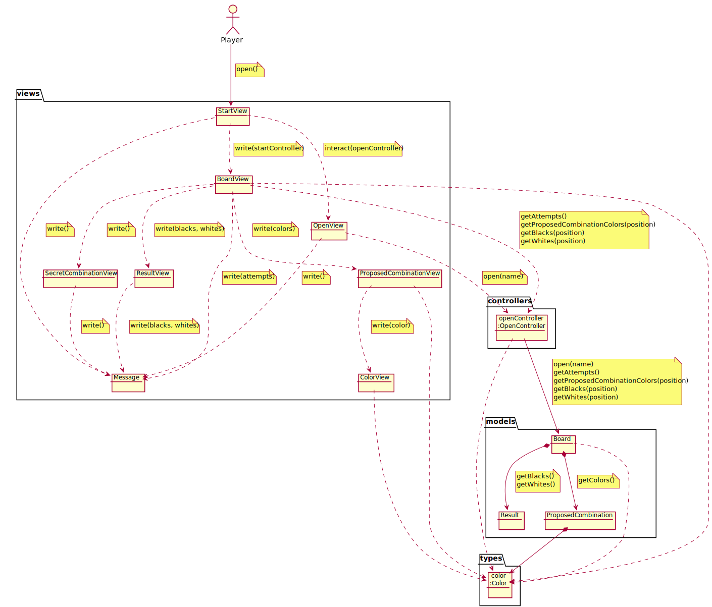

### Analisis Propose
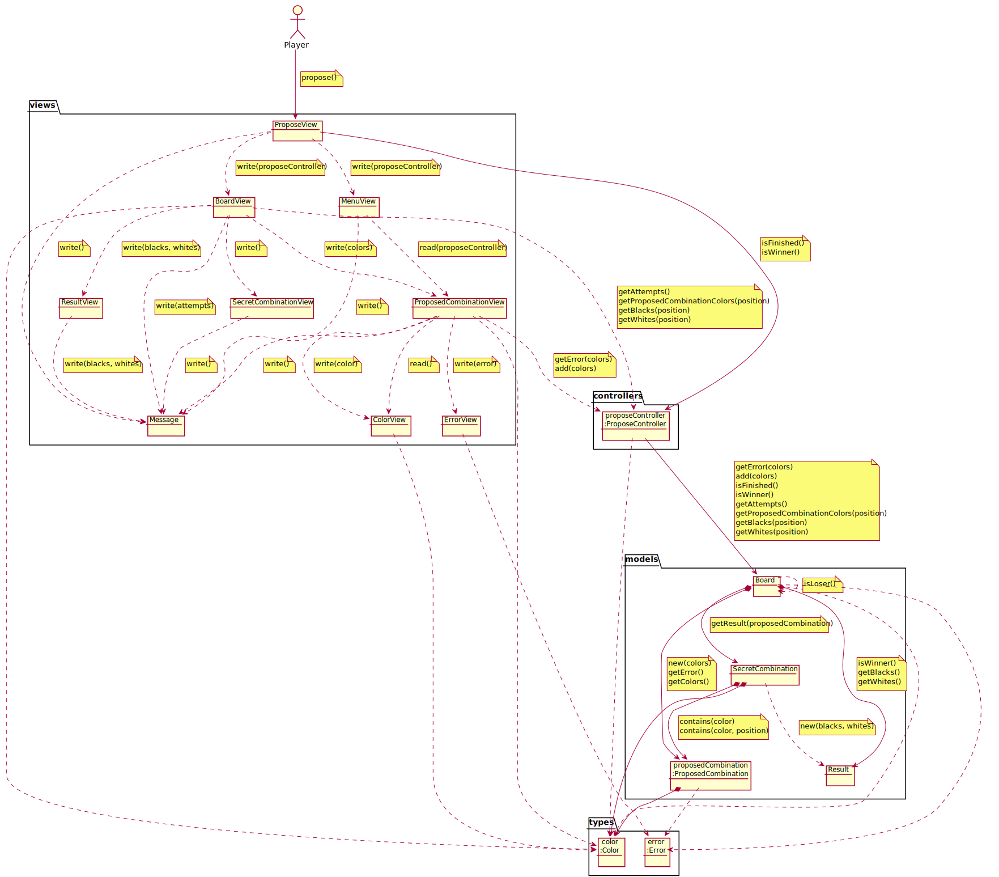  

### Analisis Undo
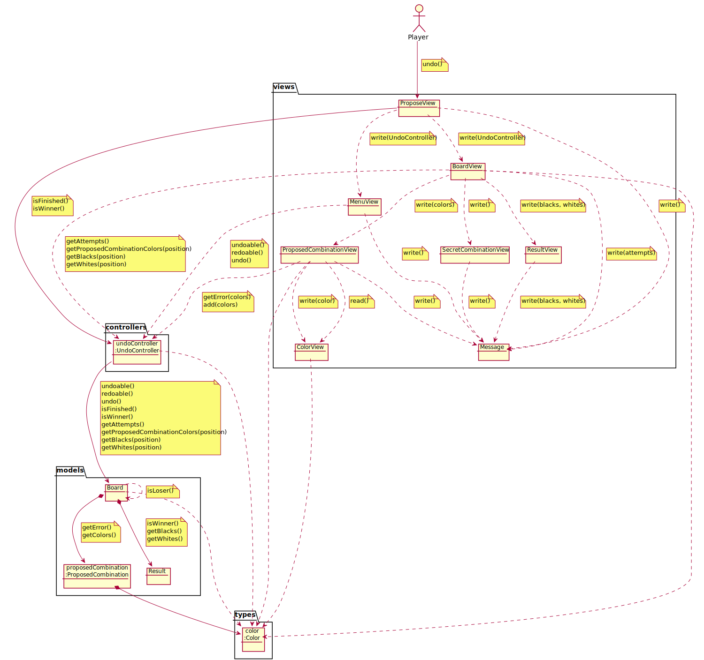  

### Analisis Redo
  

### Analisis Exit
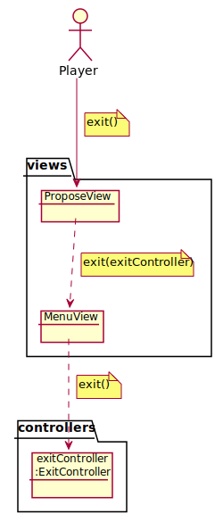

### Analisis Save
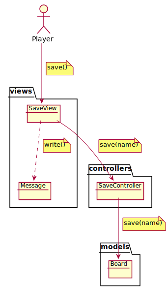

### Analisis Resume
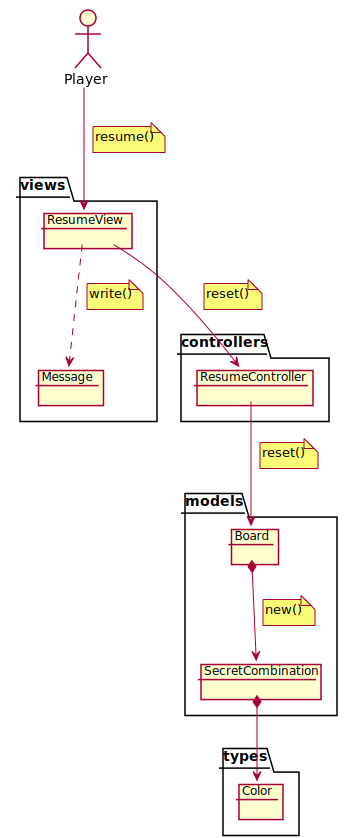

## Paquetes
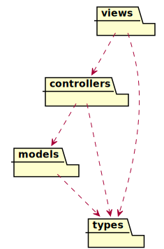

### Vistas
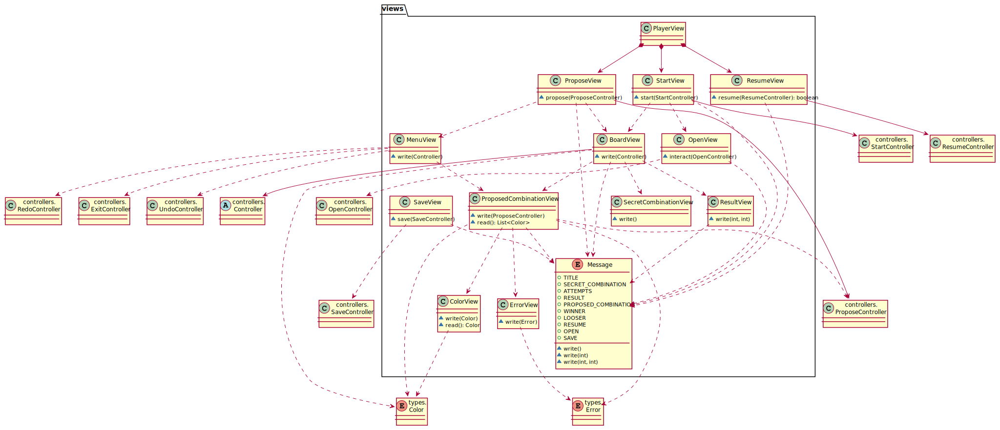

### Controladores
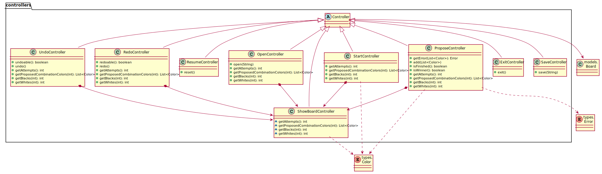

### Modelos
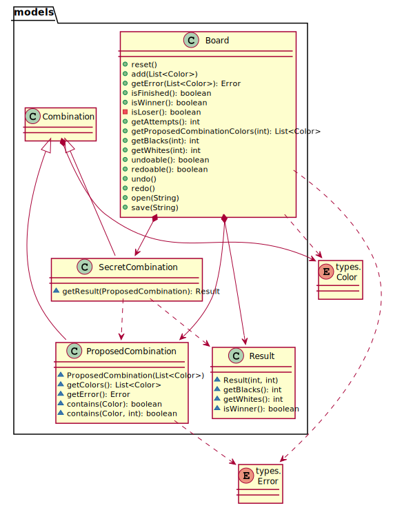

### Types
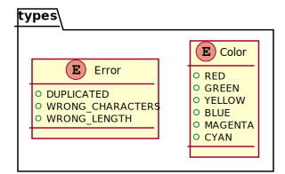  

## Diseño  

### Vista de Despliegue  
<!--  -->

### Vista de Participantes  
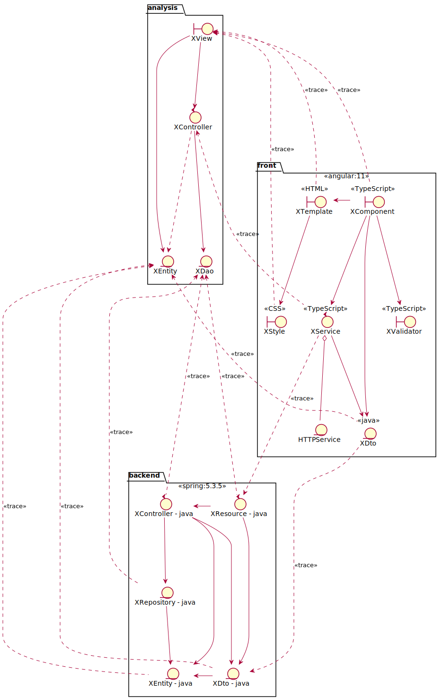  

### Vista de Interacción de Participantes  
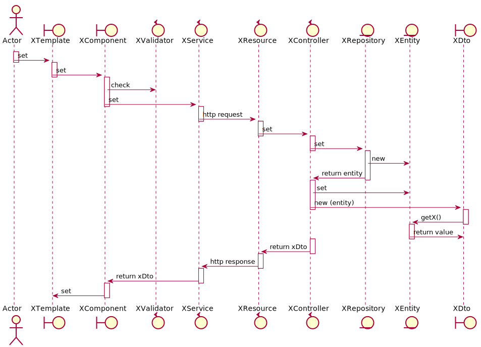  
